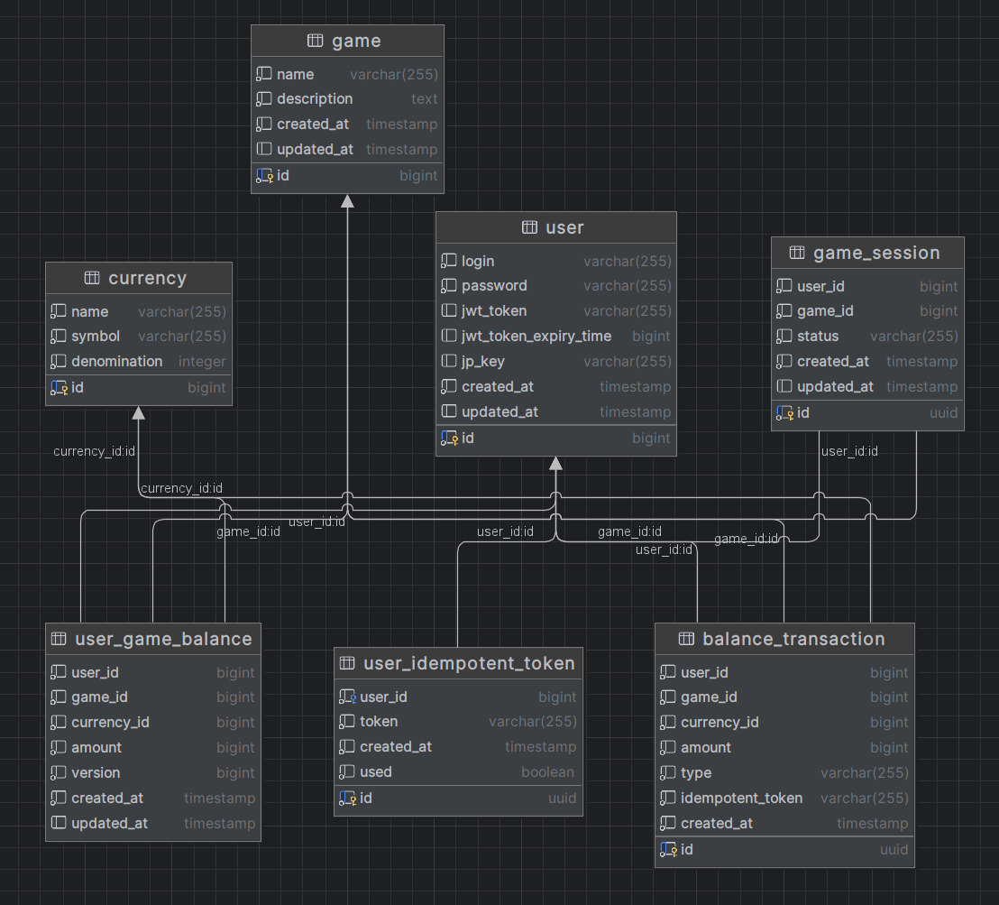

# Gaming hub
### 1. Start application
```
docker-compose up --build
```
### 2. Swagger for testing (main api is secured by jwt, use test data)

```
http://localhost:8083/swagger-ui/index.html
```

### 3. Test data

User (id, userName, password):

```
1, Player1, 123
2, Player2, 123
```

User game balance (userId, gameId, currencyId, amount)
```
1, 1, 1, 14500
1, 1, 2, 1000
1, 1, 3, 500
2, 2, 2, 5050
```

Game session (id, userId, gameId):
```
0581ae43-f844-4c5e-aef0-a935394d69bc, 1, 1
4fcb57bf-9d40-48e2-8cc6-77832a163d62, 2, 2
```

### 4. DB Schema

<p align="center">
  
</p>